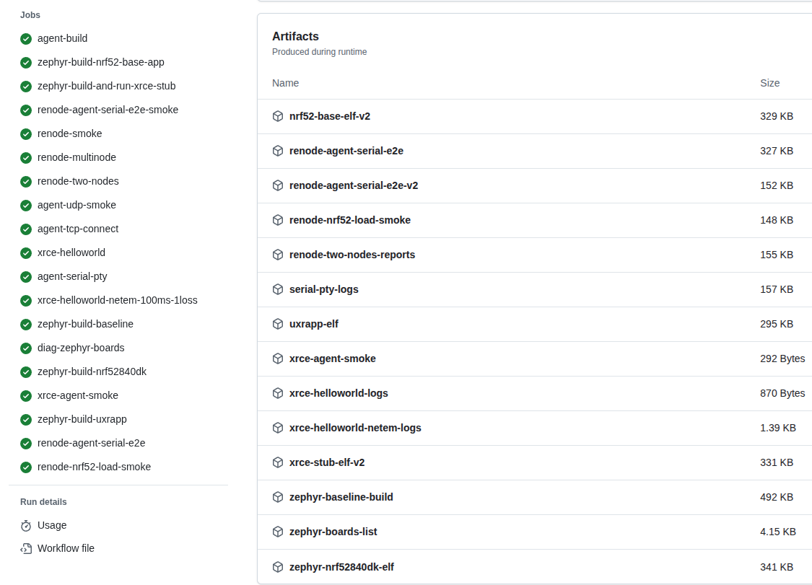
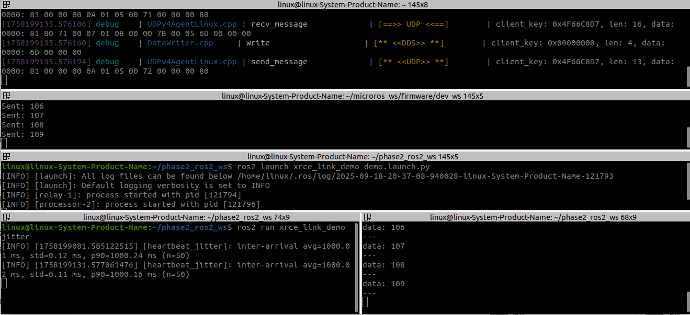

# xrce-link-lab

**End-to-end XRCE-DDS lab in two complementary parts:**

* **Phase 1 — CI-only, hardware-free.**
  GitHub Actions builds Zephyr firmware (nRF52), builds the Micro XRCE-DDS Agent, and verifies the MCU ↔ Agent link using a PTY simulation. Delivers a **fully green CI matrix** plus downloadable artifacts (ELF/HEX, agent/PTY logs). Safe, reproducible, and great for automation.

* **Phase 2 — Local ROS 2 demo (Ubuntu 22.04 + Humble).**
  A **host micro-ROS client** talks over **rmw\_microxrcedds** to the **Micro XRCE-DDS Agent**, then into the **ROS 2 graph**. Includes a tiny ROS 2 package (`xrce_link_demo`) providing a relay, a simple processor, and a **jitter** metric node (avg/std/p90). Phase 2 is intentionally **decoupled** so Phase 1 CI stays deterministic.

> Why keep Phase 2 separate inside the same repo?
> To **protect Phase 1 CI** while still giving a hands-on ROS 2 demo that reviewers can run locally in minutes.

---

## Repository layout

```
.
├─ .github/workflows/ci.yml   # Phase 1 CI: Zephyr build + Agent + E2E PTY smoke (keep green)
├─ firmware/                  # Phase 1 sources / build scripts (see CI for artifacts)
├─ phase2_ros2_ws/            # Phase 2: minimal ROS 2 workspace
│  └─ src/xrce_link_demo/     # relay / processor / jitter / launch + demo screenshots
└─ README.md
```

---

## Keep Phase 1 CI green (even when editing Phase 2)

Add path gating to `.github/workflows/ci.yml` so edits under Phase 2 **don’t trigger** the CI:

```yaml
on:
  push:
    branches: [ "main" ]
    paths-ignore:
      - 'phase2_ros2_ws/**'
      - 'phase2/**'
  pull_request:
    paths-ignore:
      - 'phase2_ros2_ws/**'
      - 'phase2/**'
```

> This repo doesn’t add any Phase 2 workflows; CI remains dedicated to Phase 1.

---

## Screenshots





---

## Phase 1 (CI) at a glance

* Builds:

  * Zephyr ELF/HEX for nRF52840 targets
  * Micro XRCE-DDS Agent
  * PTY-based E2E smoke (no hardware)
* Artifacts (download from CI run): firmware images and logs (`agent.log`, `uart.log`, Renode/PTY logs).
* Purpose: prove the **MCU ↔ Agent link** is automatable and stable without local environment drift.

---

## Phase 2 (local ROS 2 demo)

> **Prereqs**: Ubuntu 22.04, **ROS 2 Humble** (`/opt/ros/humble`), and:
>
> ```bash
> sudo apt update
> sudo apt install -y python3-vcstool python3-colcon-common-extensions
> ```

Open **four terminals**.

### A — Micro XRCE-DDS Agent

```bash
unset RMW_IMPLEMENTATION; unset ROS_DOMAIN_ID
source /opt/ros/humble/setup.bash
micro-ros-agent udp4 --port 8888 -v6
```

### B — micro-ROS host client (publisher)

> micro-ROS sources are **not** committed here; fetch at build time.

```bash
# Minimal micro-ROS ws
mkdir -p ~/microros_ws/firmware/dev_ws/src
cd ~/microros_ws

# (Fetch sources via micro_ros_setup or your bootstrap script)
# Make sure std_msgs is built as shared with microxrcedds typesupport:
#   -DBUILD_SHARED_LIBS=ON
#   -DROSIDL_TYPESUPPORTS=rosidl_typesupport_microxrcedds_c

# Activate and run
source firmware/dev_ws/install/setup.bash
export RMW_IMPLEMENTATION=rmw_microxrcedds
export MICRO_ROS_AGENT_IP=127.0.0.1
export MICRO_ROS_AGENT_PORT=8888
ros2 run micro_ros_demos_rclc int32_publisher || \
ros2 run micro_ros_demos_rclc int32_publisher_node
```

### C — Relay + processor (this repo)

```bash
cd ./phase2_ros2_ws
source /opt/ros/humble/setup.bash
colcon build --symlink-install
source install/setup.bash
ros2 launch xrce_link_demo demo.launch.py
```

### D — Verify & collect metrics

```bash
source /opt/ros/humble/setup.bash
ros2 topic echo /std_msgs_msg_Int32 --qos-profile sensor_data
ros2 topic echo /mcu/heartbeat
ros2 topic hz /mcu/heartbeat
ros2 run xrce_link_demo jitter
```

**Expected**: Agent shows `session established` / `write`; publisher prints `Sent: N`; `/mcu/heartbeat` echoes at \~1 Hz; `jitter` reports avg≈1000 ms, std≈0.1 ms, p90≈1000.1 ms.

---

## Troubleshooting (Phase 2)

* **No data on `/std_msgs_msg_Int32`**
  Ensure Terminal B exported:

  ```bash
  export RMW_IMPLEMENTATION=rmw_microxrcedds
  export MICRO_ROS_AGENT_IP=127.0.0.1
  export MICRO_ROS_AGENT_PORT=8888
  ```

  Try `--qos-profile sensor_data` when echoing.

* **Agent quiet when publisher runs**
  Start Agent first; verify IP/port; clear env (`unset RMW_IMPLEMENTATION; unset ROS_DOMAIN_ID`).

* **`could not load libstd_msgs__rosidl_typesupport_microxrcedds_c.so`**
  Rebuild **std\_msgs** as shared with micro-XRCE typesupport:

  ```bash
  cd ~/microros_ws/firmware/dev_ws
  rm -rf build/std_msgs install/std_msgs log
  source /opt/ros/humble/setup.bash
  source install/setup.bash
  colcon build --symlink-install \
    --cmake-args -DBUILD_TESTING=OFF -DBUILD_SHARED_LIBS=ON \
                 -DROSIDL_TYPESUPPORTS=rosidl_typesupport_microxrcedds_c \
    --packages-select std_msgs
  ```

---


## License

Apache-2.0 for original work here. Third-party projects fetched via `vcs import` or CI retain their original licenses.

---

想再精簡或改用 `docs/` 放圖都沒問題；你把這一版貼上去就會同時把兩階段交代清楚，且 Phase 2 的存在與「不影響 CI」的理由也一目了然。
